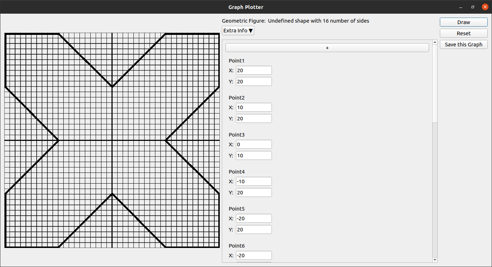

# graph-plotter 

A Graph Plotter written in python and built on Qt framework.\
The graph is plotted on the left side and the points are given on the right side.\
You can also save the graph on your computer.
### GUI

### After it is saved

The saved photo right now has transparent background but in future, it can be customized

---
## Summary

  - [Installing](#installing)
  - [Contributing](#contributing)
  - [Versioning](#versioning)
  - [License](#license)
  - [Acknowledgments](#acknowledgments)

## Installing
Please refer to [INSTALLING.md](https://github.com/sumagnadas/graph-plotter/INSTALLING.md) on how to make this program work on your computer

## Contributing
If you want to contribute to this repository, then create an issue about the bug or the feature. After that, fork this repository and create a pull request stating what changes have you done.

## Versioning

For the versions available, see the [tags on this repository](https://github.com/sumagnadas/graph-plotter/tags).  

## License
This project is licensed under the GPL-2.0 License - see the [LICENSE](LICENSE) file for details

## Acknowledgments
Thanks to the people on IRC of PySide2 and python who helped me fix the errors I got while making this. Some of the code is also taken from the examples present on <a href="zetcode.com">ZetCode</a>.
